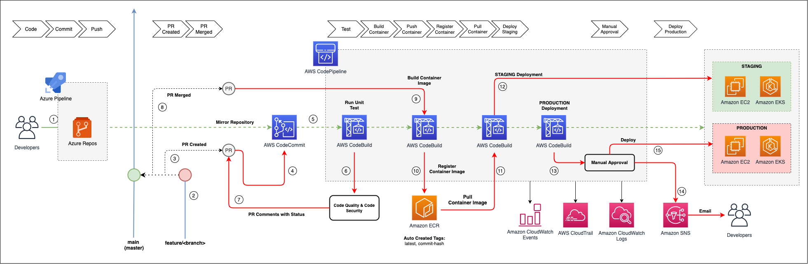
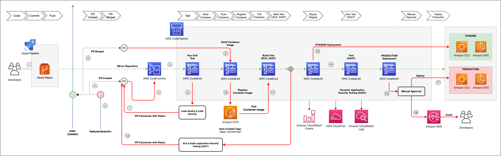

## Changelog GO App

### version 3.2

- All features in version 3.1
- Added sample script CI/CD Pipeline with semantic version (semver) docker build images
  - AWS CodePipeline (`cicd-aws-codepipeline.yml`)
  - Azure DevOps (`cicd-azure-devops.yml`)
  - Bitbucket (`cicd-bitbucket.yml`)
  - GitHub Action (`cicd-github.yml`)
  - GitLab (`cicd-gitlab.yml`)
  - Jenkins CI/CD (`cicd-jenkins.jenkinsfile`)

### version 3.1

- All features in version 3.0
- Upgrade golang version 1.19.5
- Update `Dockerfile.alpine-3.15` for using golang version 1.19.3 for alpine-3.15 (`golang:1.19.3-alpine3.15`)
- Update `Dockerfile.alpine-3.16` for using golang version 1.19.5 for alpine-3.16 (`golang:1.19.5-alpine3.16`)
- Added `Dockerfile.alpine-3.17` for using golang version 1.19.5 for alpine-3.17 (`golang:1.19.5-alpine3.17`)
- Upgrade dependencies golang `go.mod` & `go.sum`
- Refactoring pattern source code (moving) to path "src"
- Refactoring CI/CD pipeline with spesific grouping folder
  - AWS CodePipeline (`.aws`)
  - Azure DevOps (`.azure-devops`)
  - Bitbucket (`.bitbucket`)
  - GitHub (`.github`)
  - GitLab (`.gitlab`)
  - Jenkins (`.jenkins`) CI/CD with Spinnaker CD
- Refactoring build, tag, push & pull script for DockerHub
- Refactoring build, tag, push & pull script for ECR
- Refactoring `makefile` script automation for build, tag, push & pull

### version 3.0

- All features in version 2.3
- Upgrade golang version 1.19
- Update Dockerfile for using golang version 1.19 (`golang:1.19.2-alpine3.15` & `golang:1.19.2-alpine3.16`)
- Added docker-compose configuration & running script docker-compose
- Upgrade dependencies golang `go.mod` & `go.sum`
- Refactoring source code (moving) dependencies to `devopscorner/golang-deployment`
- Update `gorm` model & sqlite connection driver

### version 2.3

- All features in version 2.2
- Refactoring path & references docs

### version 2.2

- Add multiple container registry (DockerHub & ECR) deployment
- Update Golang version 1.18 for Alpine 3.15 & Alpine 3.16 container
- Refactoring makefile for added multiple container registry
- Add documentation for build, tag & push container image to **DockerHub**, go to [this](docs/container-bookstore-dockerhub.md) link
- Add documentation for build, tag & push container to **Amazon ECR (Elastic Container Registry)**, go to [this](docs/container-bookstore-ecr.md) link
- Refactoring workflow documentation, go to [this](docs/workflow-cicd-bookstore-pipeline.md) link

### version 2.1

- Add Configuration Pipeline Synchronize for Mirroring Repository into AWS CodeCommit
  - [GitHub Repository](.github/workflows/synchronize.yml)
  - [GitLab Repository](.gitlab-ci.yml)
  - [BitBucket Repository](bitbucket-pipelines.yml)
  - [Azure DevOps Repository](azure-pipelines.yml)
- GitOps Flow
  - Azure DevOps Pipeline
    
- GitOps DevSecOps Flow
  - Azure DevSecOps Pipeline
    

### version 2.0

- IAM Role sample for CodeBuild & CodePipeline
- Buildspec CodePipeline for Build Container Image inside CodeBuild using Spesific CodeCommit
- Buildspec CodePipeline for Deploy EKS Cluster inside CodeBuild using Spesific CodeCommit
- Buildspec without CodePipeline for Build Container Image inside CodeBuild using 3rd party repository (GitHub, GitLab, BitBucket, Azure DevOps)
- Buildspec without CodePipeline for Deploy EKS Cluster inside CodeBuild using 3rd party repository (GitHub, GitLab, BitBucket, Azure DevOps)
- Setup `~/.ssh/known_hosts` for authorization host 3rd party repository
- Setup `~/.ssh/config` for authorization config ssh key 3rd party repository
- Dynamic Tags with COMMIT_HASH

### version 1.0

- Golang API Rest (bookstore)
- Postman Collection
- Container Builder GO
- Push Container to ECR
- Deploy Kubernetes with Helm Values
- Buildspec for AWS CodeBuild & AWS CodePipeline

### version 0.1

- First deployment GO Apps
- Script build image
- Script ecr-tag & ecr-push
- Helm deployment values
- Upgrade gomod, using GO `1.17`
- Dockerfile using `golang:1.17-alpine3.15`
